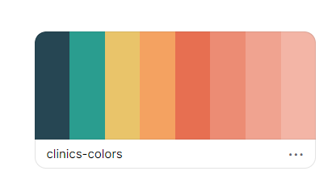

# directory-of-clinics

This is a capstone project for HTML and CSS part of Microverse program.

This project is an online clinic directory website, which contains 3 pages:

1- Homepage.
2- Search results page.
3- Internal clinic page (details page).

- Each page with 3 responsive breakpoints

## How to navigate through the website:

- Clinics link in the navbar takes you to the clinic's search result page.
- Inside the clinic card in the clinic result page after you hover on any card it will show to you a link to the clinic details page.
- About link in the Navbar takes you to the footer section at the about section.
- Home link in the navbar takes you to the homepage.

## Animation:

- Header logo.
- Navbar icons.
- How it works cards when hover.
- Clinic cards inside clinic result page.
- Choose the appointment button on the details page.

## I used:

- HTML5.
- CSS3.
- flexbox.
- Fontawesome.
- CSS animation.

## colors:

- I used this color palette:

## The content of each page:

# General content:

- Each page contains a responsive Header and Footer.

# Home page:

- Box for search.
- 4 cards display How the website for online clinic reservation works.
- 3 cards display the most important advantages of using this website.

- ScreenShot for the desktop version of the page:
  

# Search Result page:

- Box for search.
- 3 cards show how the results for clinics will appear.

- ScreenShot for the desktop version of the page:
  

# Internal clinic page (details page):

- clinic location with embedded google map.
- clinic basic information.

- ScreenShot for the desktop version of the page:
  

## Live Demo

Here you will find a Live Demo page, any comment is well received.

[Live Demo Link](https://raw.githack.com/AhmedAmin90/directory-of-clinics/project/index.html)

## Authors

Please feel free to contact me at any time:

😎 **Ahmed Amin**

- Github: [@AhmedAmin90](https://github.com/AhmedAmin90)
- Twitter: [@AhmedAmin12383](https://twitter.com/AhmedAmin12383)
- LinkedIn: [in/web-developer](https://www.linkedin.com/in/web-developer)

## 🤝 Contributing

Contributions, issues, and feature requests are welcome!

Feel free to check the [issues page](https://github.com/AhmedAmin90/directory-of-clinics/issues).

## Show your support

Give a ⭐️ if you like this project!
Also, the advice is well received.

## Thanks for Design Idea:

This design is modified from: https://www.behance.net/gallery/25563385/PatashuleKE
Designed by:

- Mathew Njuguna from Nairobi, Kenya.
- Sam Achola from Nairobi, Kenya.

## Acknowledgments

- Microverse Team.

## 📝 License

This project is [MIT](LICENSE.md) licensed.
