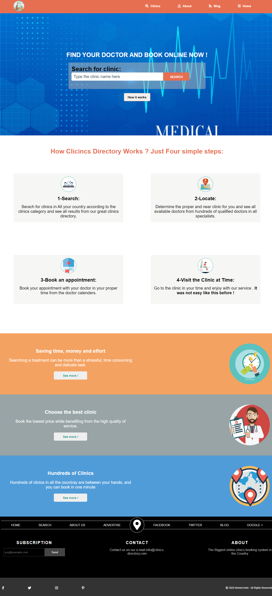
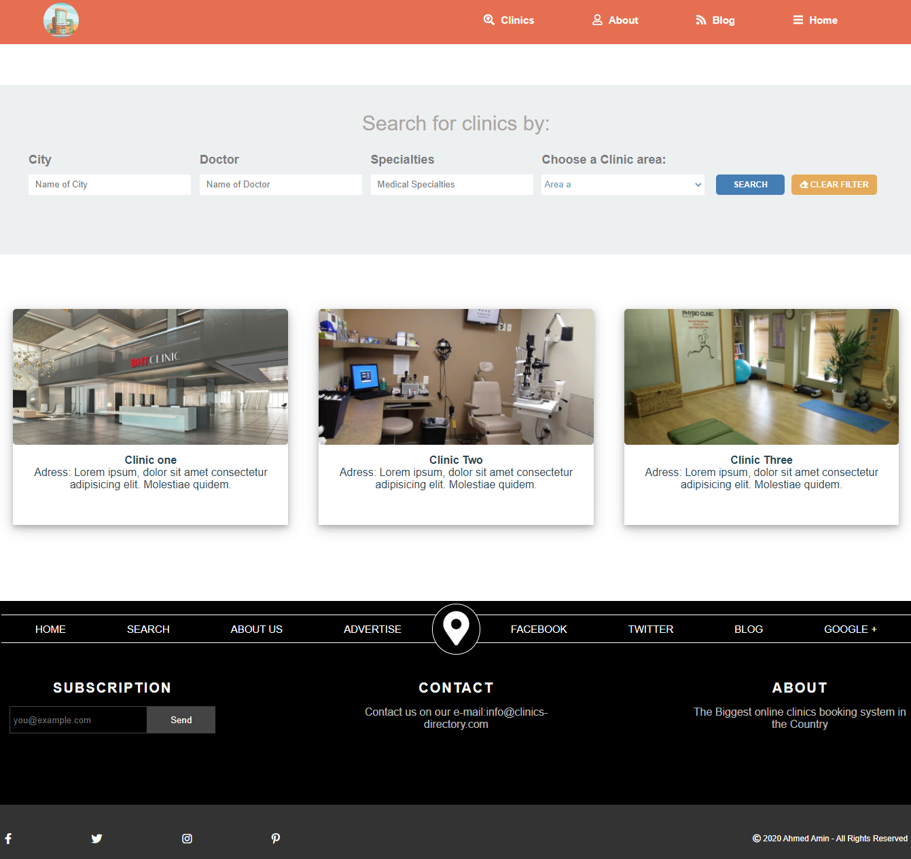

# directory-of-clinics

This is a capstone project for HTML and CSS part in Microverse program.

This project is an online clinic directory website, which contains 3 pages:

1- Homepage.
2- Search results page.
3- Internal clinic page (detatils page).

- Each page with 3 responsive breakpoints

## I used:

- HTML5.
- CSS3.
- flex box.
- Fontawesome.
- CSS animation.

## The content of each page:

# General content:

- Each page contains responsive Header and Footer.

# Home page:

- Box for serach.
- 4 cards display How the website for online clinic reservation works.
- 3 cards display the most important advantages for using this website.

- ScreenShot for the desktop version of the page:
  

# Search Result page:

- Box for search.
- 3 cards show how the results for clinics will appear.

- ScreenShot for the desktop version of the page:
  

# Internal clinic page (detatils page):

- clinic location with embede google map.
- clinic basic information.

- ScreenShot for the desktop version of the page:
  

## Live Demo

Here you will find a Live Demo page, any comment is well recieved.

[Live Demo Link](https://ahmedamin90.github.io/directory-of-clinics/)

## Authors

Please feel free to contact me in any time:

😎 **Ahmed Amin**

- GitHub: [@githubhandle](https://github.com/AhmedAmin90)
- Twitter: [@twitterhandle](https://twitter.com/AhmedAmin12383)
- LinkedIn: [LinkedIn](https://www.linkedin.com/in/ahmed-amin-quality/)

## 🤝 Contributing

Contributions, issues, and feature requests are welcome!

Feel free to check the [issues page](https://github.com/AhmedAmin90/directory-of-clinics/issues).

## Show your support

Give a ⭐️ if you like this project!
Also advices are well recieved.

## Acknowledgments

- Microverse Team.

## 📝 License

This project is [MIT](LICENSE.md) licensed.
